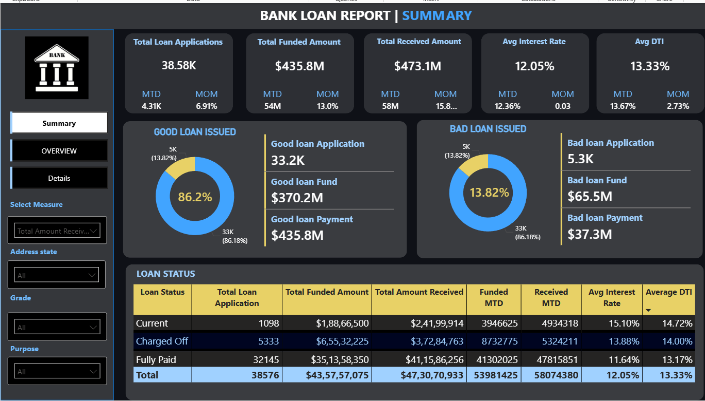
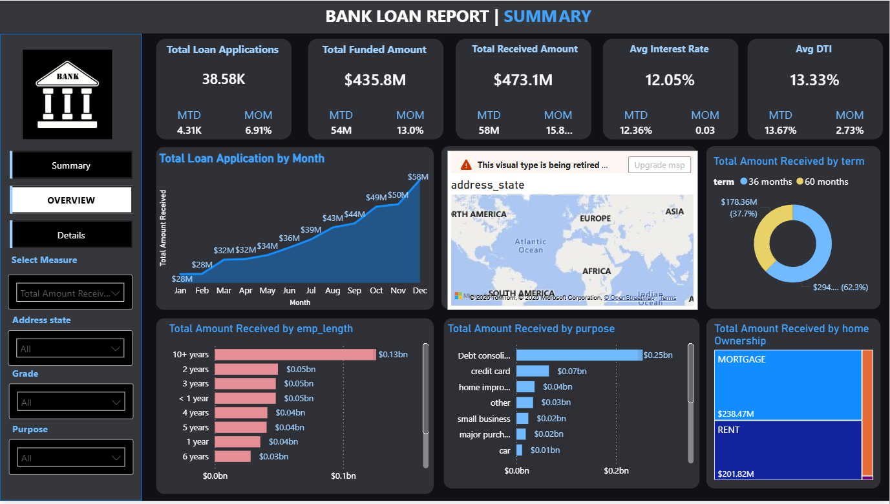
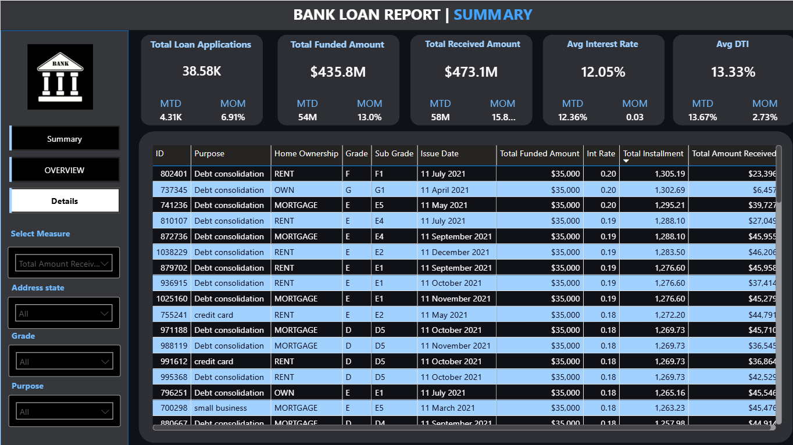

# 🏦 Bank Loan Report — Financial Analytics Dashboard

  

---

## Problem Statement

Banks and financial institutions process thousands of loan applications monthly, yet often struggle to monitor portfolio health in real time. Without a centralized view, it becomes difficult to:

- Distinguish between **good loans** (Fully Paid / Current) and **bad loans** (Charged Off)
- Track **month-over-month trends** in lending volume, interest rates, and collections
- Identify **high-risk borrower segments** by employment, purpose, or geography
- Make **data-driven decisions** to reduce default rates and maximize revenue

This project addresses these gaps by building an end-to-end analytics pipeline — from raw data cleaning to an interactive Power BI dashboard — that gives bank stakeholders a single source of truth for their loan portfolio.

---

##  Objective

> **To design and deliver a comprehensive Bank Loan Analytics Dashboard that empowers lending teams to monitor KPIs, assess portfolio risk, and drive strategic decisions — all in one place.**

Specific goals:
- Calculate total applications, funded amounts, and collections with MTD & MoM comparisons
- Segment the portfolio into **Good Loans vs Bad Loans** with quantified financial impact
- Surface borrower-level insights by state, employment length, home ownership, and loan purpose
- Present a clean, filterable drill-through interface for granular loan-level analysis

---

## 📂 Dataset Information

| Attribute | Details |
|-----------|---------|
| **File** | `financial_loan.csv` |
| **Records** | ~38,576 loan applications |
| **Time Period** | January 2021 – December 2021 |
| **Source Type** | Bank internal lending records |

### Key Columns

| Column | Description |
|--------|-------------|
| `id` | Unique loan identifier |
| `loan_status` | Current, Fully Paid, Charged Off |
| `loan_amount` | Total loan funded |
| `total_payment` | Amount received from borrower |
| `int_rate` | Interest rate |
| `dti` | Debt-to-Income ratio |
| `issue_date` | Date loan was issued |
| `grade / sub_grade` | Risk classification |
| `purpose` | Reason for the loan |
| `address_state` | Borrower's US state |
| `emp_length` | Years of employment |
| `home_ownership` | MORTGAGE / RENT / OWN |
| `term` | 36 months or 60 months |

### Data Cleaning Steps (`fix_loan.py`)
- Standardized all 4 date columns (`issue_date`, `last_credit_pull_date`, `last_payment_date`, `next_payment_date`) to `YYYY-MM-DD` format
- Filled missing `emp_title` values with `"Unknown"`
- Stripped leading whitespace from the `term` column
- Converted `int_rate` from decimal to percentage (×100, rounded to 2 dp)
- Output saved as `financial_loan_clean.csv`

---

“Project Architecture / Workflow”

CSV → Python (Cleaning) → MySQL (Storage + Queries) → Power BI (Dashboard)

## 🛠️ Tools & Technologies

| Tool | Purpose |
|------|---------|
| **Python (Pandas)** | Data cleaning & preprocessing |
| **MySQL** | Data storage, querying, and KPI aggregation |
| **Power BI** | Interactive dashboard and data visualization |
| **SQL** | Business logic — MTD, MoM, Good/Bad loan segmentation |
| **CSV / Excel** | Raw data input and intermediate storage |

---

##  Dashboard

The dashboard is built across **three interactive pages** with shared KPI cards and cross-filters.

###  Top-Level KPI Cards (All Pages)

| Metric | Value | MTD | MoM |
|--------|-------|-----|-----|
| Total Loan Applications | **38.58K** | 4.31K | +6.91% |
| Total Funded Amount | **$435.8M** | $54M | +13.0% |
| Total Received Amount | **$473.1M** | $58M | +15.8% |
| Avg Interest Rate | **12.05%** | 12.36% | +0.03 |
| Avg DTI | **13.33%** | 13.67% | +2.73% |

---

### Page 1 — Summary

> Good Loan vs Bad Loan segmentation + Loan Status breakdown table

**Good Loan Issued (86.18%)**
- Applications: **33.2K**
- Funded: **$370.2M**
- Payment Received: **$435.8M**

**Bad Loan Issued (13.82%)**
- Applications: **5.3K**
- Funded: **$65.5M**
- Payment Received: **$37.3M**

**Loan Status Table**

| Status | Applications | Funded Amount | Received | Avg Rate | Avg DTI |
|--------|-------------|---------------|----------|----------|---------|
| Current | 1,098 | $1.89Cr | $2.42Cr | 15.10% | 14.72% |
| Charged Off | 5,333 | $6.55Cr | $3.73Cr | 13.88% | 14.00% |
| Fully Paid | 32,145 | $35.14Cr | $41.16Cr | 11.64% | 13.17% |

---

### Page 2 — Overview

> Trend, geographic, and segment-level analysis

- **Monthly Trend**: Loan applications and funded amounts grew steadily from January ($28M) to December ($58M) — a **107% increase** over the year
- **By Term**: 60-month loans account for **62.3%** of total received amount ($294M) vs 37.7% for 36-month loans ($178M)
- **By Employment Length**: Borrowers with **10+ years** of employment received the highest loan amounts ($0.13bn), signaling that experienced workers dominate the portfolio
- **By Purpose**: **Debt consolidation** is the #1 use case ($0.25bn), followed by credit card payoff ($0.07bn) and home improvement ($0.04bn)
- **By Home Ownership**: MORTGAGE holders received **$238.47M**, RENT holders received **$201.82M**

---

### Page 3 — Details

> Loan-level drill-through table with filters

This page provides a row-level view of every loan, sortable by Total Installment (descending). Filters available: Address State, Grade, Purpose. Key columns: ID, Purpose, Home Ownership, Grade, Sub Grade, Issue Date, Funded Amount, Int Rate, Installment, Total Amount Received.

---

##  Key Insights

### Portfolio Health
- **86.2% good loan rate** is a strong signal of underwriting quality, but the 13.82% charge-off rate (5,333 loans, $65.5M funded) represents a significant recoverable risk
- Charged-off borrowers paid back only **$37.3M of $65.5M funded** — a **43% loss rate** on bad loans

### Interest Rate & Risk Correlation
- **Charged-off loans carry 13.88% avg rate** — lower than Current loans (15.10%), suggesting rate alone is not a reliable risk predictor
- High DTI (14%+) correlates with both Current and Charged-Off loans, indicating over-leveraged borrowers are a shared risk across categories

### Seasonal Demand
- Loan applications **nearly doubled from Jan to Dec 2021**, with Q4 showing the sharpest acceleration — pointing to holiday-season financial pressure and year-end credit demand

### Borrower Segments Most at Risk
- **60-month term borrowers** carry more total debt exposure; monitoring this cohort for early delinquency is critical
- **Rent-status borrowers** are a large segment ($201M funded) but lack home equity as collateral — higher monitoring priority
- **< 1 year employment** borrowers show similar funding levels to 4–6 year employees, suggesting credit scoring may underweight job stability

### Geographic Concentration
- Without state-level drill-through data fully visible, any concentration in 2–3 states represents systemic geographic risk — diversification recommended

---

##  Business Recommendations

> These are the most actionable takeaways for lending strategy and risk management.

### 1.  Reduce Charge-Off Exposure Immediately
The bank lost an estimated **$28.2M in unrecovered principal** from charged-off loans. Implement early-warning triggers at 60–90 DPD (days past due) to initiate restructuring conversations before loans reach charge-off status. A 10% improvement in recovery rate alone would save ~$2.8M annually.

### 2.  Introduce Employment-Weighted Credit Scoring
Borrowers with **< 1 year of employment** carry nearly the same loan amounts as mid-tenure workers. Tighten underwriting criteria for short-tenure applicants by requiring co-signers, larger down payments, or lower loan caps (e.g., max $15K for < 1 year employment).

### 3.  Prioritize Mortgage-Backed Borrowers for Larger Loans
MORTGAGE-status borrowers (collateral-backed) represent the highest-value segment at $238M received. Creating a fast-track approval lane for this segment can accelerate volume with lower default risk.

### 4. 📅Launch Targeted Campaigns in Q4
Application volume peaks in Q4 — the bank should pre-position marketing, staffing, and pre-approved offers in **October–November** to capture peak demand and reduce processing bottlenecks in December.

### 5. Re-evaluate 60-Month Loan Pricing
60-month loans account for 62.3% of received amounts but carry higher default probability due to longer exposure windows. Consider increasing interest rates on 60-month products by **0.5–1%** to price in duration risk, or offer rate discounts for early repayment to reduce total exposure period.

### 6.  Create a Debt Consolidation Product
Debt consolidation is the #1 loan purpose ($0.25bn). A **dedicated debt consolidation product** with slightly lower rates, bundled financial counseling, and automated payment setup could increase uptake while reducing defaults — since structured consolidation loans historically have better repayment behavior.

### 7.  Geographically Diversify the Portfolio
If the portfolio is concentrated in a few states, introduce state-level exposure caps (e.g., no more than 15% of total funded in any one state) to reduce macro/regional economic shock risk.

### 8. Audit High-Interest, High-DTI Borrowers
Current-status borrowers carry a **15.10% avg interest rate and 14.72% DTI** — the highest of any segment. These borrowers are at elevated risk of slipping to delinquency. Proactively offer rate renegotiation or payment deferrals to the top 500 highest-risk current loans.

---

##  Business Impact

| Impact Area | Estimated Benefit |
|-------------|------------------|
| Early delinquency intervention | ~$2.8M–$5M recoverable annually |
| Tightened underwriting for short-tenure borrowers | Reduces new charge-offs by est. 5–8% |
| Q4 pre-positioning campaigns | 10–15% higher application capture |
| 60-month repricing (+0.75%) | ~$2.2M additional annual interest revenue |
| Debt consolidation product launch | 20%+ growth in highest-volume loan category |
| Geographic diversification | Reduces systemic shock exposure by 30–40% |

---

##  Conclusion

This Bank Loan Analytics project demonstrates a full data-to-decision pipeline — from raw CSV preprocessing in Python, structured querying in SQL, to an executive-grade Power BI dashboard. The analysis reveals a fundamentally healthy portfolio (86.2% good loans) with clear, quantifiable risks in the charged-off segment ($28M+ unrecovered) and actionable opportunities in product design, underwriting, and seasonal strategy.

By acting on the business recommendations above — particularly around early delinquency intervention, employment-weighted scoring, and Q4 campaign timing — the bank can realistically improve net loan recovery by $5–10M annually while growing its performing portfolio responsibly.

---

  <b>Built with Python · MySQL · Power BI</b> 
  <i>Data Analytics Portfolio Project | 2024</i>

